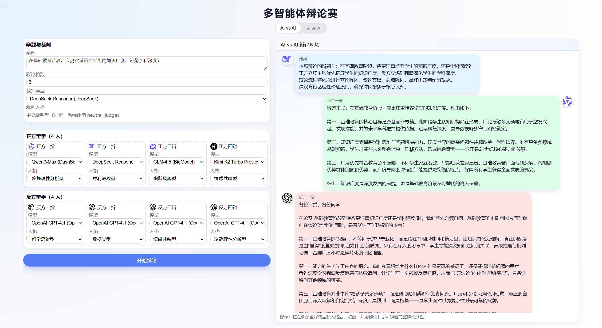
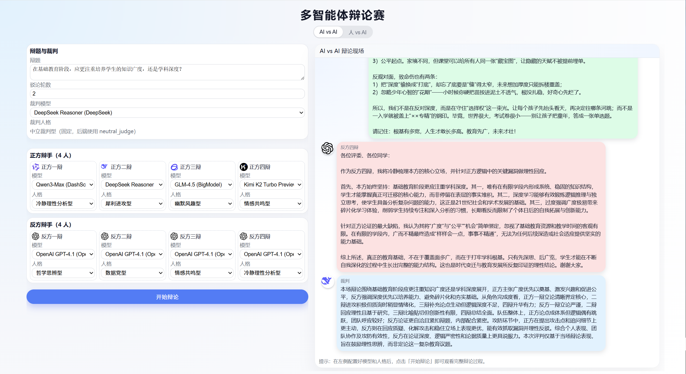

# 多智能体辩论赛（Agent Debate）

一个基于 **FastAPI + LangGraph + LangChain OpenAI** 的多智能体辩论 Demo，支持：

- 🧠 **AI vs AI 多智能体辩论**
  - 裁判 + 正反双方各 4 名辩手
  - 不同辩位（1–4 辩）分工不同，人设可配置
  - 支持流式输出（NDJSON）
- 👤 **人 vs AI 一对一辩论**
  - 你选择正方 / 反方
  - AI 队伍由 4 位“辩手”轮流登场（各司其职：立论 / 驳论 / 举例 / 总结）
  - 聊天室式交互体验
- 🖥 内置一个简单前端页面，开箱即用
- 
- 

---

## 目录

- [项目结构](#项目结构)
- [环境准备](#环境准备)
- [安装依赖](#安装依赖)
- [配置环境变量](#配置环境变量)
- [命令行 Demo](#命令行-demo)
- [启动后端服务](#启动后端服务)
- [使用前端页面](#使用前端页面)

---

## 项目结构

```text
.
├─ requirements.txt
├─ README.md
├─ .env                           # 存放各种模型的 KEY & BASE_URL
├─ demo.py                        # 命令行 Demo
└─ app/
   ├─ __init__.py
   ├─ api.py                      # FastAPI 入口
   ├─ agent.py                    # DebateState / AgentRole / speak_with_role
   ├─ graph.py                    # 辩论流程的 LangGraph FSM
   ├─ config.py                   # 模型 profile & 预设人格
   ├─ index.html                  # 前端页面
   └─ static/                     # 静态资源：头像等
```

---

## 环境准备

- Python 版本：推荐 **3.10+**
- 需要可以访问各大模型提供方的网络环境（OpenAI / DeepSeek / 通义 / Kimi / 智谱 等）

---

## 安装依赖

### 1. 创建虚拟环境（可选但推荐）

```bash
python -m venv .venv
```

### 2. 安装依赖

```bash
pip install -r requirements.txt
```

---

## 配置环境变量

所有模型配置都在 `app/config.py` 的 `MODEL_PROFILES` 里，例如：

```python
MODEL_PROFILES = {
    "gpt4.1": {
        "model": "gpt-4.1",
        "api_key_env": "OPENAI_API_KEY",
        "base_url_env": "OPENAI_BASE_URL",
        "label": "OpenAI GPT-4.1",
        "group": "OpenAI",
    },
    "deepseek-chat": {
        "model": "deepseek-chat",
        "api_key_env": "DEEPSEEK_API_KEY",
        "base_url_env": "DEEPSEEK_BASE_URL",
        "label": "DeepSeek Chat",
        "group": "DeepSeek",
    },
    "deepseek-reasoner": {
        "model": "deepseek-reasoner",
        "api_key_env": "DEEPSEEK_API_KEY",
        "base_url_env": "DEEPSEEK_BASE_URL",
        "label": "DeepSeek Reasoner",
        "group": "DeepSeek",
    },
    "qwen3-max": {
        "model": "qwen3-max",
        "api_key_env": "DASHSCOPE_API_KEY",
        "base_url_env": "DASHSCOPE_BASE_URL",
        "label": "Qwen3-Max",
        "group": "DashScope",
    },
    "kimi-k2-turbo-preview": {
        "model": "kimi-k2-turbo-preview",
        "api_key_env": "MOONSHOT_API_KEY",
        "base_url_env": "MOONSHOT_BASE_URL",
        "label": "Kimi K2 Turbo Preview",
        "group": "Kimi",
    },
    "glm-4.5": {
        "model": "glm-4.5",
        "api_key_env": "BIGMODEL_API_KEY",
        "base_url_env": "BIGMODEL_BASE_URL",
        "label": "GLM-4.5",
        "group": "BigModel",
    },
}
```

可以配置这些环境变量

- `OPENAI_API_KEY`
- `OPENAI_BASE_URL`
- `DEEPSEEK_API_KEY`
- `DEEPSEEK_BASE_URL`
- `DASHSCOPE_API_KEY`
- `DASHSCOPE_BASE_URL`
- `MOONSHOT_API_KEY`
- `MOONSHOT_BASE_URL`
- `BIGMODEL_API_KEY`
- `BIGMODEL_BASE_URL`

### 使用 .env 文件（推荐）

根目录创建 `.env` 文件，例如：

```env
# OpenAI
OPENAI_API_KEY=sk-xxxx
OPENAI_BASE_URL=https://api.openai.com/v1

# DeepSeek
DEEPSEEK_API_KEY=ds-xxxx
DEEPSEEK_BASE_URL=https://api.deepseek.com

# 阿里通义（DashScope）
DASHSCOPE_API_KEY=ds-xxxx
DASHSCOPE_BASE_URL=https://dashscope.aliyuncs.com/compatible-mode/v1

# Kimi Moonshot
MOONSHOT_API_KEY=ms-xxxx
MOONSHOT_BASE_URL=https://api.moonshot.cn/v1

# 智谱 BigModel
BIGMODEL_API_KEY=glm-xxxx
BIGMODEL_BASE_URL=https://open.bigmodel.cn/api/paas/v4
```

`config.py` 里已经有 `load_dotenv()`，会自动加载这些变量。

---

## 命令行 Demo

```bash
python -m app.demo
```

---

## 启动后端服务

确保当前目录在项目根目录，然后执行：

```bash
uvicorn app.api:app --reload
```

---

## 使用前端页面

### 访问入口

启动 `uvicorn` 后，浏览器打开：

> http://127.0.0.1:8000/


